# Circuit Breaker Implementation Guide

This guide covers the circuit breaker implementation in the OIF Aggregator, providing automatic protection against cascading failures by temporarily blocking requests to failing solvers.

The circuit breaker pattern prevents cascading failures by monitoring service health and automatically "opening" (blocking requests) when failures exceed configurable thresholds. This allows failing services time to recover while protecting the overall system stability.

## Architecture

### State Machine

The circuit breaker follows a standard 3-state pattern:

```mermaid
graph TD
    A[CLOSED<br/>✅ Allow all requests<br/>📊 Monitor performance] 
    B[OPEN<br/>❌ Block all requests<br/>⏱️ Wait for timeout]
    C[HALF-OPEN<br/>🧪 Allow limited test requests<br/>📈 Evaluate results]
    
    A -->|failures exceed<br/>threshold| B
    B -->|timeout expires| C
    C -->|test success| A
    C -->|test failure<br/>longer timeout| B
    
    style A fill:#e8f5e8
    style B fill:#ffebee  
    style C fill:#fff3e0
```



**States:**
- **CLOSED** - Normal operation, all requests allowed
- **OPEN** - Blocking requests due to failures, waiting for timeout
- **HALF_OPEN** - Testing recovery with limited requests

### Request Processing Pipeline (GetQuotes)


**Performance Optimization**: Circuit breaker filtering now happens AFTER compatibility filtering, reducing expensive circuit breaker checks from potentially 1000 solvers to only the ~20 compatible ones.

## Key Features

### Primary Decision Logic (Fast Path)

- **Metrics Freshness**: All metrics-based decisions apply only if metrics were updated within 30 minutes
- **Consecutive Failures**: `>= 5` consecutive failures → Circuit opens (only if metrics fresh)
- **Success Rate**: `< 20%` success rate (min 30 requests) → Circuit opens (only if metrics fresh) 
- **Service Error Rate**: `< 20%` service error rate → Circuit opens (only if metrics fresh)
- **Fail-Open Safety**: Skips ALL metrics-based checks if data is stale (prevents false positives)
- **Performance**: Non-blocking, uses existing `SolverMetrics` with consistent freshness validation

### Automatic Recovery

- **Exponential Backoff**: `base_timeout * 2^failure_count` (capped at 10 minutes)
- **Half-Open Testing**: Allows up to 5 test requests for recovery validation
- **Self-Healing**: Circuits automatically recover on successful tests
- **Smart Hybrid Logic**: Collects multiple test results with early success/failure detection

### Persistent Failure Handling

After `max_recovery_attempts` (default: 10), three configurable strategies:

1. **`ExtendTimeout`** (Default): Use 24-hour timeout between attempts
2. **`DisableSolver`**: Set solver status to Disabled (requires manual intervention)  
3. **`KeepTrying`**: Continue indefinitely with capped timeout

## Benefits

- **Prevents cascading failures** - Automatically blocks failing solvers
- **Self-healing** - Recovers when solvers become healthy  
- **Fast failure detection** - Multiple thresholds for rapid response
- **Configurable thresholds** - Tune for specific environments
- **Production-ready** - Fail-safe design with comprehensive logging
- **Performance optimized** - Non-blocking decision logic

## Configuration

The circuit breaker is highly configurable to suit different deployment environments. For complete configuration options and examples, see the [Configuration Guide](configuration.md).

### Quick Example

Minimal development settings:

```json
{
  "circuit_breaker": {
    "enabled": true,
    "failure_threshold": 10,
    "success_rate_threshold": 0.1,
    "base_timeout_seconds": 10,
    "persistent_failure_action": "KeepTrying"
  }
}
```

## 📚 Related Documentation

- **[Configuration Guide](configuration.md)** - Complete circuit breaker configuration options
- **[Quick Start Guide](quick-start.md)** - Getting started with the OIF Aggregator  
- **[Quotes & Aggregation Guide](quotes-and-aggregation.md)** - How the circuit breaker affects quote processing
- **[Maintenance Guide](maintenance.md)** - Monitoring and operational considerations
- **[Security Guide](security.md)** - Security considerations

---
