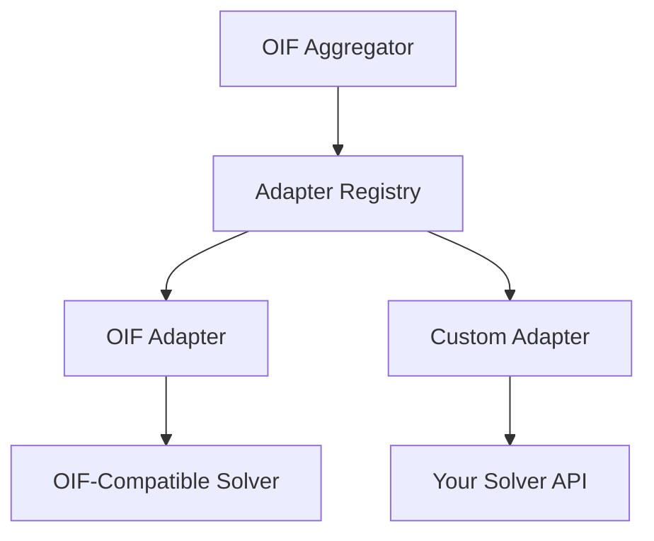
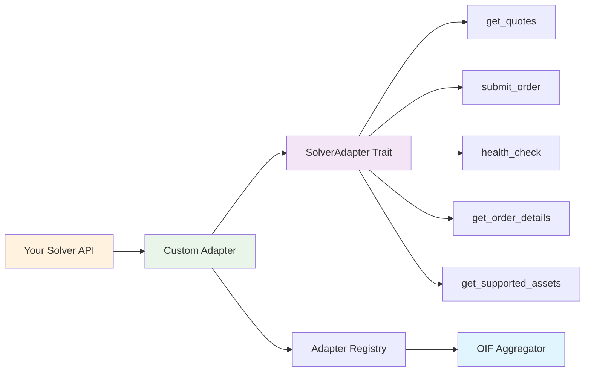

# Custom Adapter Implementation Guide

This guide explains how to create custom adapters for the OIF Aggregator, enabling integration with new solvers and protocols.

## 🎯 Overview

Adapters serve as the bridge between the OIF Aggregator and external solver protocols. They translate the standard OIF requests into solver-specific API calls and convert responses back to the standard format.

### Architecture



### Custom Adapter Integration Points



## 🛠️ Implementing a Custom Adapter

### Reference Implementations

Before implementing your own adapter, check the existing implementations in `crates/adapters/src/` for reference:

- **`oif_adapter.rs`** - Standard OIF protocol adapter implementation
- **`mod.rs`** - Adapter registry and factory patterns

These provide working examples of:
- HTTP client configuration and error handling
- Request/response transformation patterns
- Authentication and header management
- Timeout and retry logic
- Testing patterns and mock implementations

### 1. Dependencies

Add these dependencies to your `Cargo.toml`:

```toml
[dependencies]
oif-types = { path = "../oif-aggregator/crates/types" }
async-trait = "0.1"
serde = { version = "1.0", features = ["derive"] }
serde_json = "1.0"
reqwest = { version = "0.11", features = ["json"] }
tokio = { version = "1.0", features = ["full"] }
```

### 2. Basic Adapter Structure

Create your adapter by implementing the `SolverAdapter` trait:

```rust
use async_trait::async_trait;
use oif_types::{
    adapters::{
        traits::SolverAdapter,
        models::{SubmitOrderRequest, SubmitOrderResponse},
        GetOrderResponse, SolverRuntimeConfig, AdapterResult,
    },
    models::{Asset, Network},
    Adapter, GetQuoteRequest, GetQuoteResponse,
};

#[derive(Debug)]
pub struct MyCustomAdapter {
    adapter_info: Adapter,
    client: reqwest::Client,
}

impl MyCustomAdapter {
    pub fn new() -> Self {
        let adapter_info = Adapter::new(
            "my-custom-v1".to_string(),
            "Custom adapter for My Solver".to_string(),
            "My Custom Adapter".to_string(),
            "1.0.0".to_string(),
        );

        Self {
            adapter_info,
            client: reqwest::Client::new(),
        }
    }

    pub fn with_default_config() -> Self {
        Self::new()
    }
}

#[async_trait]
impl SolverAdapter for MyCustomAdapter {
    fn adapter_info(&self) -> &Adapter {
        &self.adapter_info
    }

    async fn get_quotes(
        &self,
        request: &GetQuoteRequest,
        config: &SolverRuntimeConfig,
    ) -> AdapterResult<GetQuoteResponse> {
        // 1. Convert GetQuoteRequest to your solver's model
        // 2. Fetch quotes from solver endpoint  
        // 3. Convert solver response to GetQuoteResponse format
        todo!("Implement quote fetching logic")
    }

    async fn submit_order(
        &self,
        order: &SubmitOrderRequest,
        config: &SolverRuntimeConfig,
    ) -> AdapterResult<SubmitOrderResponse> {
        // 1. Convert SubmitOrderRequest to your solver's model
        // 2. Submit order to solver endpoint
        // 3. Convert solver response to SubmitOrderResponse format
        todo!("Implement order submission logic")
    }

    async fn health_check(&self, config: &SolverRuntimeConfig) -> AdapterResult<bool> {
        // 1. Make health check request to solver endpoint
        // 2. Return true if solver is healthy, false otherwise
        todo!("Implement health check logic")
    }

    async fn get_order_details(
        &self,
        order_id: &str,
        config: &SolverRuntimeConfig,
    ) -> AdapterResult<GetOrderResponse> {
        // 1. Fetch order status from solver endpoint using order_id
        // 2. Convert solver response to GetOrderResponse format
        todo!("Implement order details fetching logic")
    }

    async fn get_supported_assets(
        &self,
        config: &SolverRuntimeConfig,
    ) -> AdapterResult<SupportedAssetsData> {
        // Choose your mode:
        
        // Option 1: Assets mode (any-to-any, including same-chain)
        let assets = vec![/* fetch from API */];
        Ok(SupportedAssetsData::Assets(assets))
        
        // Option 2: Routes mode (precise origin->destination pairs)
        let routes = vec![/* fetch from API */];
        Ok(SupportedAssetsData::Routes(routes))
    }
}
```

### 🎯 Choosing Assets vs Routes Mode

**Use Assets Mode When:**
- ✅ Your solver supports any-to-any conversions within asset list
- ✅ You want to support same-chain swaps
- ✅ Route list would be very large (O(N²) explosion)
- ✅ Example: DEX aggregators, OIF protocol

**Use Routes Mode When:**
- ✅ Your solver has specific supported routes
- ✅ Not all asset pairs are supported
- ✅ You want precise compatibility checking
- ✅ Example: Bridge protocols, Across protocol

**Auto-Discovery vs Manual Configuration:**
- **Auto-Discovery**: Omit `supported_assets` - adapter fetches from API
- **Manual Config**: Define `supported_assets` - use static configuration

## 📝 Registration and Configuration

### 1. Register Your Adapter

```rust
use oif_aggregator::AggregatorBuilder;
use oif_types::solvers::Solver;

#[tokio::main]
async fn main() -> Result<(), Box<dyn std::error::Error>> {
    // Create your custom adapter
    let custom_adapter = MyCustomAdapter::new();
    
    // Create a solver configuration for your adapter
    let custom_solver = Solver::new(
        "my-custom-solver".to_string(),
        "my-custom-v1".to_string(),      // Must match your adapter's ID
        "https://api.my-solver.com".to_string(),
    );
    
    // Register adapter and solver with the aggregator
    let (_app, _state) = AggregatorBuilder::default()
        .with_adapter(Box::new(custom_adapter))
        .with_solver(custom_solver)
        .start()
        .await?;
    
    // The app router is ready to handle HTTP requests
    // Available endpoints: /health, /v1/quotes, /v1/orders, /v1/solvers
    
    Ok(())
}
```

### 2. Configuration File

Add your solver to `config/config.json`:

```json
{
  "solvers": {
    "my-solver": {
      "solver_id": "my-solver",
      "adapter_id": "my-custom-v1",
      "endpoint": "https://api.mysolver.com/v1",
      "enabled": true,
      "headers": {
        "Authorization": "Bearer your-api-key",
        "X-Custom-Header": "value"
      },
      "name": "My Custom Solver",
      "description": "Integration with My Custom Solver"
    }
  }
}
```

## 🔧 Advanced Features

### Caching Support

```rust
use oif_adapters::{ClientCache, ClientConfig};
use std::sync::Arc;
use std::time::Duration;

#[derive(Debug)]
pub struct MyCustomAdapter {
    adapter_info: Adapter,
    cache: ClientCache,
}

impl MyCustomAdapter {
    pub fn new() -> Self {
        Self {
            adapter_info: Adapter::new(
                "my-custom-v1".to_string(),
                "Custom adapter with caching".to_string(),
                "My Custom Adapter".to_string(),
                "1.0.0".to_string(),
            ),
            cache: ClientCache::for_adapter(), // Default adapter cache with 5-minute TTL
        }
    }
    
    /// Get optimized HTTP client with connection pooling and keep-alive
    fn get_client(&self, solver_config: &SolverRuntimeConfig) -> AdapterResult<Arc<reqwest::Client>> {
        // ClientConfig is automatically created from SolverRuntimeConfig
        let client_config = ClientConfig::from(solver_config);
        self.cache.get_client(&client_config)
    }
}

// Alternative: Custom TTL
impl MyCustomAdapter {
    pub fn with_custom_cache_ttl() -> Self {
        Self {
            adapter_info: Adapter::new(
                "my-custom-v1".to_string(),
                "Custom adapter with custom TTL".to_string(),
                "My Custom Adapter".to_string(),
                "1.0.0".to_string(),
            ),
            cache: ClientCache::with_ttl(Duration::from_secs(300)), // 5 minutes
        }
    }
}
```

## 🔗 Related Documentation

- **[Configuration Guide](configuration.md)** - How to configure solvers
- **[API Documentation](api/)** - Complete API reference
- **[Quotes & Aggregation Guide](quotes-and-aggregation.md)** - Understanding the aggregation process

---

**Need Help?** Check the existing adapters in `crates/adapters/src/` for reference implementations, or open an issue on GitHub for specific questions.
