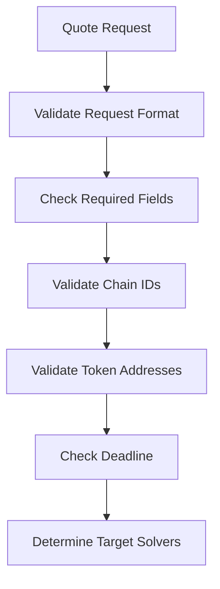
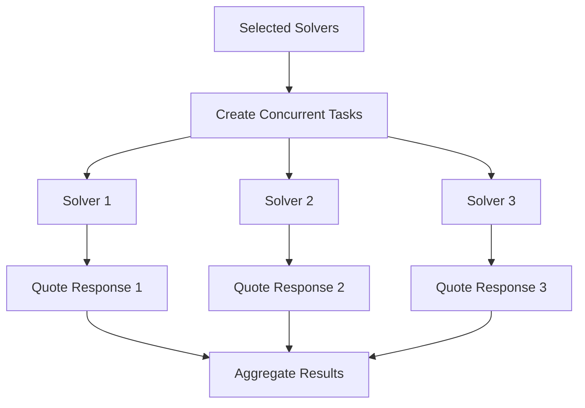

# Quotes & Aggregation Guide

This guide explains how the OIF Aggregator's quote system works, including the quotes endpoint, aggregation logic, and integration options.

## 🎯 Overview

The OIF Aggregator collects quotes from multiple DeFi solvers and presents them in a unified format. This allows users to compare options across different protocols and chains to find the best execution path for their intents.

## 📡 Quotes Endpoint

### `POST /v1/quotes`

Request quotes from multiple solvers.

#### Request Format (ERC-7930 Standard)

```json
{
  "user": "0x01000002147a6970997970C51812dc3A010C7d01b50e0d17dc79C8",
  "availableInputs": [
    {
      "user": "0x01000002147a6970997970C51812dc3A010C7d01b50e0d17dc79C8",
      "asset": "0x01000002147a695FbDB2315678afecb367f032d93F642f64180aa3",
      "amount": "1000000000000000000"
    }
  ],
  "requestedOutputs": [
    {
      "receiver": "0x01000002147a6a3C44CdDdB6a900fa2b585dd299e03d12FA4293BC",
      "asset": "0x01000002147a6a5FbDB2315678afecb367f032d93F642f64180aa3",
      "amount": "1000000000000000000"
    }
  ],
  "preference": "speed",
  "minValidUntil": 600,
  "solverOptions": {}
}
```

#### Request Parameters

| Field | Type | Required | Description |
|-------|------|----------|-------------|
| `user` | `string` | ✅ | User's wallet address in ERC-7930 format |
| `availableInputs` | `array` | ✅ | Available input tokens with amounts |
| `availableInputs[].user` | `string` | ✅ | Token holder address (ERC-7930 format) |
| `availableInputs[].asset` | `string` | ✅ | Token contract address (ERC-7930 format) |
| `availableInputs[].amount` | `string` | ✅ | Token amount in smallest unit (wei/satoshi) |
| `availableInputs[].lock` | `object` | ❌ | Optional lock parameters |
| `requestedOutputs` | `array` | ✅ | Desired output tokens |
| `requestedOutputs[].receiver` | `string` | ✅ | Recipient address (ERC-7930 format) |
| `requestedOutputs[].asset` | `string` | ✅ | Token contract address (ERC-7930 format) |
| `requestedOutputs[].amount` | `string` | ✅ | Minimum expected amount |
| `requestedOutputs[].calldata` | `string` | ❌ | Optional calldata for execution |
| `minValidUntil` | `number` | ❌ | Minimum quote validity duration in seconds |
| `preference` | `string` | ❌ | Optimization preference: `"price"`, `"speed"` |
| `solverOptions` | `object` | ❌ | Advanced solver selection and timeout options |

### Solver Options Configuration

The `solverOptions` object provides fine-grained control over solver selection and aggregation behavior:

```json
{
  "solverOptions": {
    "includeSolvers": ["solver-oif-1", "solver-oif-2"],
    "excludeSolvers": ["unreliable-solver"],
    "timeout": 8000,
    "solverTimeout": 3000,
    "minQuotes": 2,
    "solverSelection": "all",
    "sampleSize": 10,
    "priorityThreshold": 75
  }
}
```

#### Solver Options Parameters

| Field | Type | Default | Range | Description |
|-------|------|---------|-------|-------------|
| `includeSolvers` | `array<string>` | All enabled | - | Specific solver IDs to include |
| `excludeSolvers` | `array<string>` | None | - | Solver IDs to exclude from query |
| `timeout` | `number` | 5000ms | 100ms - 60000ms | Global timeout for entire aggregation request |
| `solverTimeout` | `number` | 2000ms | 100ms - 30000ms | Timeout per individual solver |
| `minQuotes` | `number` | 30 | 1+ | Minimum valid quotes required before responding |
| `solverSelection` | `string` | "all" | "all", "sampled", "priority" | Strategy for selecting solvers |
| `sampleSize` | `number` | 30 | 1+ | Max solvers to query in "sampled" mode |
| `priorityThreshold` | `number` | 0 | 0-100 | Minimum solver confidence threshold for "priority" mode |

#### Solver Selection Strategies

**1. "all" (Default)**
```json
{
  "solverSelection": "all"
}
```
- Queries all enabled and healthy solvers
- Best for maximum quote coverage
- Higher latency due to more requests

**2. "sampled"**
```json
{
  "solverSelection": "sampled",
  "sampleSize": 5
}
```
- Randomly selects up to `sampleSize` solvers
- Faster responses with reduced coverage
- Good for latency-sensitive applications

**3. "priority"**
```json
{
  "solverSelection": "priority", 
  "priorityThreshold": 80
}
```
- Only queries solvers with confidence ≥ threshold
- Uses highest-performing solvers only
- Best for quality over quantity

#### Aggregation Defaults

When `solverOptions` is not provided, the system uses these defaults:

```json
{
  "solverOptions": {
    "includeSolvers": null,          // Query all enabled solvers
    "excludeSolvers": null,          // No exclusions
    "timeout": 5000,                 // 5 second global timeout
    "solverTimeout": 2000,           // 2 second per-solver timeout
    "minQuotes": 30,                 // Require at least 30 quotes
    "solverSelection": "all",        // Query all available solvers
    "sampleSize": 30,                // Default sample size (unused in "all" mode)
    "priorityThreshold": 0           // No confidence filtering
  }
}
```

#### Validation Rules

The system enforces these validation rules for solver options:

- **`minQuotes`**: Must be ≥ 1 (cannot aggregate 0 quotes)
- **`sampleSize`**: Must be ≥ 1 when using "sampled" selection
- **`priorityThreshold`**: Must be 0-100 (percentage range)
- **`timeout`**: Must be 100ms - 60000ms (global timeout range)
- **`solverTimeout`**: Must be 100ms - 30000ms (per-solver timeout range)
- **Consistency**: Global timeout must be ≥ per-solver timeout

#### Response Format

```json
{
    "quotes": [
        {
            "quoteId": "6a22e92f-3e5d-4f05-ab5f-007b01e58b21",
            "solverId": "example-solver",
            "orders": [
                {
                    "signatureType": "eip712",
                    "domain": "0x01000002147a69000000000022d473030f116ddee9f6b43ac78ba3",
                    "primaryType": "PermitBatchWitnessTransferFrom",
                    "message": {
                        "digest": "0xdfbfeb9aed6340d513ef52f716cef5b50b677118d364c8448bff1c9ea9fd0b14",
                        "eip712": {
                            "deadline": "1756457492",
                            "digest": "0xdfbfeb9aed6340d513ef52f716cef5b50b677118d364c8448bff1c9ea9fd0b14",
                            "nonce": "1756457192541",
                            "permitted": [
                                {
                                    "amount": "1000000000000000000",
                                    "token": "0x5fbdb2315678afecb367f032d93f642f64180aa3"
                                }
                            ],
                            "signing": {
                                "domain": {
                                    "chainId": 31337,
                                    "name": "Permit2",
                                    "verifyingContract": "0x000000000022d473030f116ddee9f6b43ac78ba3"
                                },
                                "noPrefix": true,
                                "primaryType": "PermitBatchWitnessTransferFrom",
                                "scheme": "eip-712"
                            },
                            "spender": "0x9fe46736679d2d9a65f0992f2272de9f3c7fa6e0",
                            "witness": {
                                "expires": 1756457492,
                                "inputOracle": "0xdc64a140aa3e981100a9beca4e685f962f0cf6c9",
                                "outputs": [
                                    {
                                        "amount": "1000000000000000000",
                                        "call": "0x",
                                        "chainId": 31338,
                                        "context": "0x",
                                        "oracle": "0x0000000000000000000000000000000000000000000000000000000000000000",
                                        "recipient": "0x0000000000000000000000003c44cdddb6a900fa2b585dd299e03d12fa4293bc",
                                        "settler": "0x000000000000000000000000cf7ed3acca5a467e9e704c703e8d87f634fb0fc9",
                                        "token": "0x0000000000000000000000005fbdb2315678afecb367f032d93f642f64180aa3"
                                    }
                                ]
                            }
                        }
                    }
                }
            ],
            "details": {
                "requestedOutputs": [
                    {
                        "receiver": "0x01000002147a6a3c44cdddb6a900fa2b585dd299e03d12fa4293bc",
                        "asset": "0x01000002147a6a5fbdb2315678afecb367f032d93f642f64180aa3",
                        "amount": "1000000000000000000",
                        "calldata": null
                    }
                ],
                "availableInputs": [
                    {
                        "user": "0x01000002147a6970997970c51812dc3a010c7d01b50e0d17dc79c8",
                        "asset": "0x01000002147a695fbdb2315678afecb367f032d93f642f64180aa3",
                        "amount": "1000000000000000000",
                        "lock": null
                    }
                ]
            },
            "validUntil": 1756457492,
            "eta": 144,
            "provider": "oif-solver",
            "integrityChecksum": "46674de706ecfa7467fbf24ec5ade684cb438313b7914c0071ab4c6af859d44b"
        }
    ],
    "totalQuotes": 1,
    "metadata": {
        "totalDurationMs": 8,
        "solverTimeoutMs": 2000,
        "globalTimeoutMs": 4000,
        "earlyTermination": false,
        "totalSolversAvailable": 1,
        "solversQueried": 1,
        "solversRespondedSuccess": 1,
        "solversRespondedError": 0,
        "solversTimedOut": 0,
        "minQuotesRequired": 30,
        "solverSelectionMode": "all"
    }
}
```

## 🔄 Aggregation Process

### 1. Request Validation



**Validation Steps:**
- ✅ Request format and required fields
- ✅ Chain ID format (hex strings)
- ✅ Token address format (valid hex addresses)
- ✅ Deadline is in the future
- ✅ Amounts are valid numbers

### 2. Solver Selection

The aggregator determines which solvers to query based on the request parameters and configuration:

**Selection Criteria:**
- **Explicit Selection**: If `includeSolvers` provided in `solverOptions`, use only those
- **Exclusion Filter**: Skip solvers listed in `excludeSolvers` 
- **Chain Compatibility**: Solver must support the requested asset pairs and chains
- **Enabled Status**: Solver must be enabled in configuration
- **Health Status**: Solver must be healthy (not failing recent requests)
- **Compatibility Check**: Based on `include_unknown_compatibility` config setting

### 3. Concurrent Quote Collection



**Timeout Handling:**
- **Per-Solver Timeout**: Each solver has individual timeout (default: 2000ms)
- **Global Timeout**: Total aggregation timeout (default: 5000ms)
- **Early Termination**: Stop when `minQuotes` requirement is met

### 4. Response Processing

#### Quote Transformation

Each solver's response is transformed into the standard format:

```rust
pub struct QuoteResponse {
    /// Unique identifier for the quote
    pub quote_id: String,
    /// ID of the solver that provided this quote
    pub solver_id: String,
    /// Array of orders
    pub orders: Vec<QuoteOrder>,
    /// Quote details matching request structure
    pub details: QuoteDetails,
    /// Quote validity timestamp
    pub valid_until: Option<u64>,
    /// Estimated time to completion in seconds
    pub eta: Option<u64>,
    /// Provider identifier
    pub provider: String,
    /// HMAC-SHA256 integrity checksum for quote verification
    /// This ensures the quote originated from the aggregator service
    pub integrity_checksum: String,
}
```

## ⚙️ Configuration Options

### Aggregation Settings

The following settings are configured in your `config.json` file and define the general behavior for all quote aggregation requests. These are system-wide defaults that apply unless overridden by specific `solverOptions` in individual quote requests.

| Setting | Description | Default | Range |
|---------|-------------|---------|-------|
| `global_timeout_ms` | Total timeout for aggregation request | 5000ms | 1000-30000ms |
| `per_solver_timeout_ms` | Timeout per individual solver request | 2000ms | 500-10000ms |
| `max_concurrent_solvers` | Max parallel solver requests | 50 | 1-50 |
| `max_retries_per_solver` | Retry attempts per failing solver | 2 | 0-3 |
| `retry_delay_ms` | Delay between retry attempts | 100ms | 100-5000ms |
| `include_unknown_compatibility` | Include solvers with unknown compatibility | `true` | boolean |


```json
{
  "aggregation": {
    "global_timeout_ms": 5000,
    "per_solver_timeout_ms": 2000,
    "max_concurrent_solvers": 50,
    "max_retries_per_solver": 2,
    "retry_delay_ms": 100,
    "include_unknown_compatibility": false
  }
}
```

**Note**: The `solver_options` in quote requests (like `minQuotes`, `solverSelection`, etc.) are runtime parameters that override these configuration defaults, while the `aggregation` config section sets the foundational behavior for all requests.

**`include_unknown_compatibility`**: Controls whether to query solvers that do not expose supported tokens/networks information. When `true`, all solvers are queried regardless of their compatibility metadata. When `false`, only solvers with known compatibility for the requested token/network pairs are queried.


**🔗 Related Documentation:**
- [API Documentation](api/) - Complete API reference
- [Configuration Guide](configuration.md) - Solver and timeout configuration
- [Security Guide](security.md) - Authentication and integrity verification
