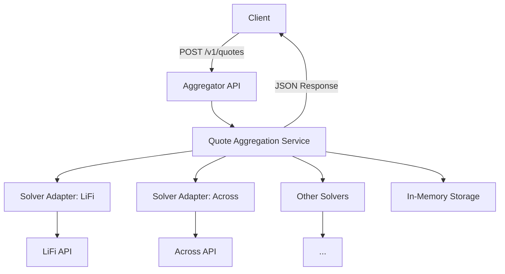

# Aggregator Project Instructions

## Overview
The Aggregator is a Rust-based proxy service built with Axum, acting as an intermediary between clients and multiple solver networks (e.g., OIF, LiFi, Across). It aggregates quotes and submits intents via a standardized REST API, with future gRPC support. The project prioritizes performance, scalability, extensibility, and security.

## Architecture
- **API Layer**: REST/JSON endpoints (`/v1/quotes`, `/v1/intents`, `/v1/intents/:id`) with OpenAPI support.
- **Service Layer**: Handles concurrent quote aggregation and intent submission.
- **Solver Adapter Layer**: Trait-based plugins for solvers, supporting HTTP-based request/response translation.
- **Storage Layer**: In-memory storage (`DashMap`) for solvers, quotes, and intents, with TTL for quotes and future Redis support.
- **Auth Layer**: IP-based rate limiting, with pluggable API key-based auth.
- **Admin API**: Manages solvers dynamically (`/admin/solvers` endpoints, Phase 2).

### Flow Diagram


## Design Priorities
- **Performance**: Minimize latency with concurrent solver requests (1000–3000 ms per-solver timeout, 3000–5000 ms global timeout).
- **Scalability**: Stateless design for horizontal scaling, with in-memory storage transitioning to Redis.
- **Extensibility**: Trait-based `SolverAdapter` and `AggregatorBuilder` for pluggable solvers and storage.
- **Security**: IP-based rate limiting, with future API key-based auth.

## Key Components
- **Solver Adapter**: Implements `SolverAdapter` trait with `get_quote` and `submit_intent` methods. Uses `reqwest` for HTTP requests.
- **Quote Aggregation**: Fetches quotes concurrently using `tokio::spawn` and `tokio::time::timeout`. Normalizes responses into `Quote` structs.
- **REST API**: Axum routes for `/v1/quotes` (POST), `/v1/intents` (POST), `/v1/intents/:id` (GET). Supports stateless intent submission with optional `quoteResponse`.
- **Storage**: `DashMap` for solvers (`solver_id`, `endpoint`, `timeout_ms`), quotes (`quote_id`, `response`, TTL), and intents (`intent_id`, `status`).
- **Builder Pattern**: `AggregatorBuilder` with methods `with_adapter`, `with_solver`, `with_storage`, `start` for flexible configuration.

## Implementation Notes
- **Language**: Rust with Axum for high performance and concurrency.
- **Timeouts**: Per-solver (1000–3000 ms) and global (3000–5000 ms) timeouts using `tokio::time::timeout`.
- **Stateless Design**: Support `quoteResponse` in `POST /v1/intents` for stateless validation, avoiding shared state across instances.
- **Configuration**: Load from `.env` or JSON (e.g., server host/port, solver endpoints, timeouts).
- **Logging**: Use `tracing` for structured logging of requests, timeouts, and errors.
- **OpenAPI**: Generate spec at `/openapi.json` using `utoipa` for SDK integration.

## Data Models
- **Solver**:
  ```json
  {
    "solver_id": "lifi-mainnet",
    "adapter_id": "lifi-v1",
    "endpoint": "https://api.lifi.com/mainnet",
    "timeout_ms": 2000,
    "status": "active"
  }
  ```
- **Quote**:
  ```json
  {
    "quote_id": "aggq-6f2e1a",
    "solver_id": "lifi-mainnet",
    "response": {}
  }
  ```
- **Intent**:
  ```json
  {
    "intent_id": "intent-xyz456",
    "quote_id": "aggq-6f2e1a",
    "status": "submitted"
  }
  ```

## Key Files
- `@src/lib.rs`: Core types, `AggregatorBuilder`, and public APIs.
- `@src/main.rs`: Axum server setup and entry point.
- `@src/api/routes.rs`: REST API routes and handlers.
- `@src/service/quote.rs`: Quote aggregation logic.
- `@src/adapters/oif.rs`: OIF solver adapter implementation.
- `@src/storage/memory.rs`: In-memory storage with `DashMap`.

## Open Questions
- Should `POST /v1/intents` require `quoteResponse` for stateless validation? (Recommended for scalability.)
- Support API key-based auth per solver, storing keys securely?
- Minimum number of solver responses for a successful `/v1/quotes`? (Suggest at least one, configurable.)
- Map solvers to supported networks/tokens for request filtering?
- Include metadata (e.g., `successful_solvers`, `failed_solvers`) in `/v1/quotes` response?

## Phase 1 Goals
- MVP with REST API, in-memory storage, and OIF + one additional solver (e.g., LiFi).
- Concurrent quote fetching with timeouts.
- IP-based rate limiting and structured logging.
- OpenAPI spec generation.
- Stateless design for horizontal scaling.